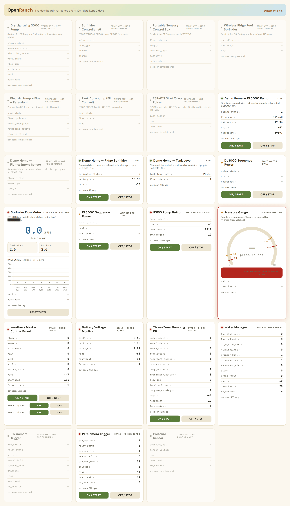
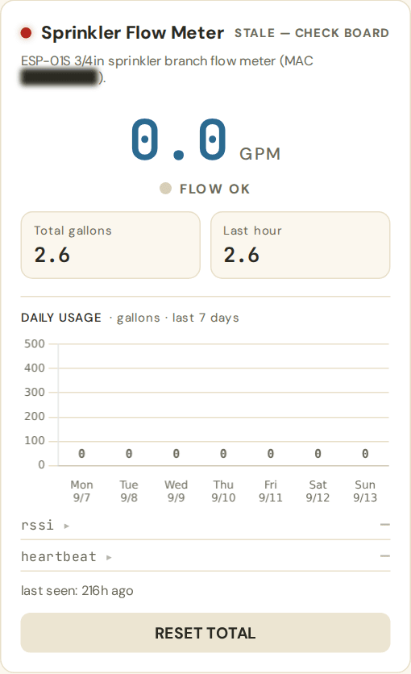
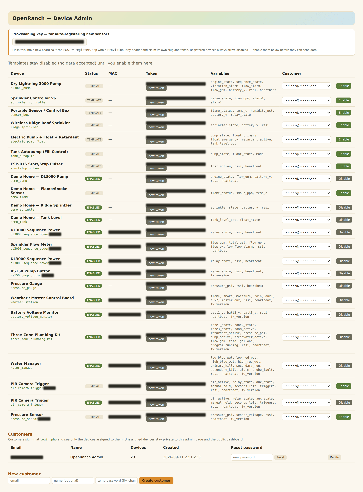
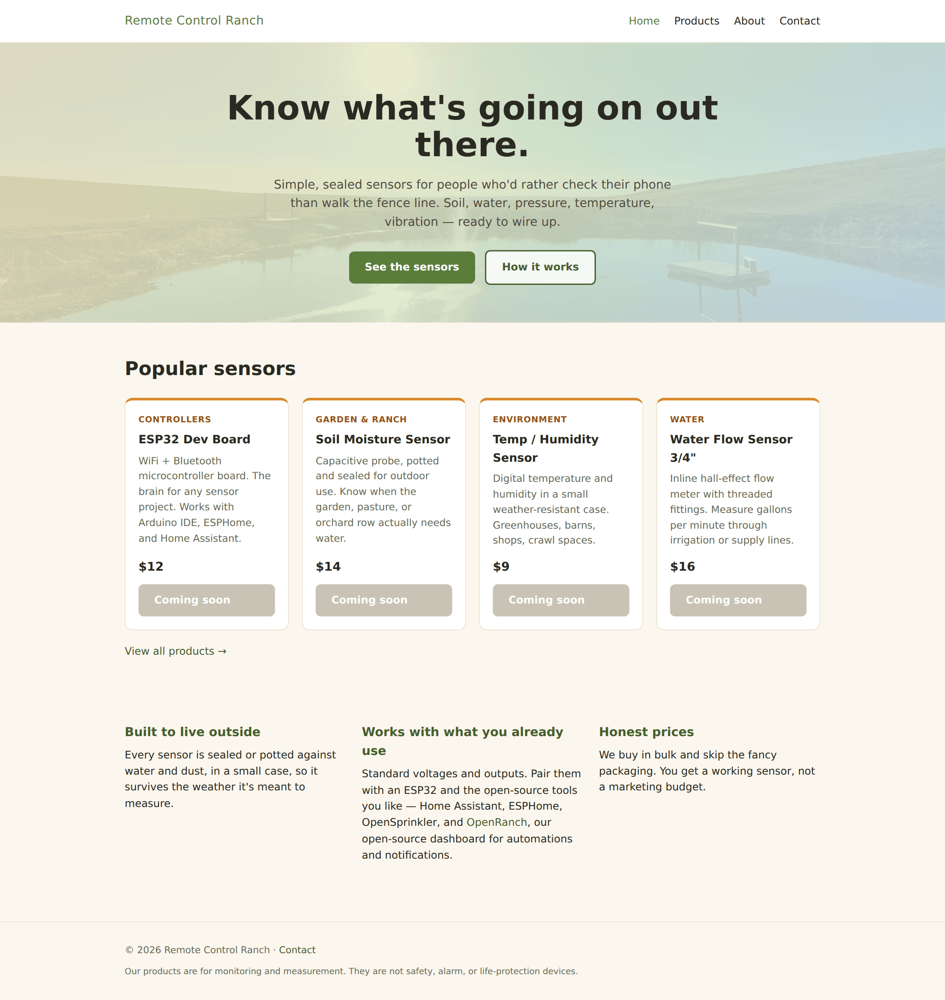

# OpenRanch Dashboard

A small, self-hosted dashboard for ESP32/ESP8266 devices around a property —
pumps, tanks, flow meters, valves, gauges, sensor boxes. Boards POST their
readings over HTTPS and poll for commands; the dashboard shows every device as
a live card, charts any variable on tap, and can send simple ON/OFF commands
back.

It is deliberately boring: plain PHP, MySQL and nginx. No framework, no build
step, no package manager, no JavaScript bundle. Drop the files on a server,
import one schema, and it runs.

Sensors that work with OpenRanch: https://remotecontrolranch.com

> ### ⚠️ Not a safety device
>
> **OpenRanch is for monitoring and measurement only. It provides no alarm,
> safety, emergency, or life-protection function of any kind.**
>
> Do not use it to protect people, animals, buildings, or property from fire,
> flood, freezing, gas, intrusion, equipment failure, or any other hazard. Do
> not rely on it to detect an emergency, to summon help, or to shut anything
> down in time to prevent harm.
>
> The words "alarm", "warn" and "limit" in this software describe **coloured
> states on a web page**, nothing more. They are not a life-safety alarm system,
> are not certified or listed by any standards body (UL, FM, EN, or otherwise),
> and are not monitored by anyone.
>
> The software is best-effort and will miss things. Notifications depend on
> mains power, your WiFi, your internet connection, your server, your MTA or
> push provider, and your phone being awake and in coverage — any one of which
> can fail silently and without warning. Readings may be stale, wrong, or
> absent. Commands may never reach a board. Data older than `RETENTION_DAYS`
> is deleted automatically.
>
> Where a failure could injure someone or cause loss, use equipment designed
> and certified for that purpose — a listed fire alarm system, a hardware
> float switch, a mechanical pressure relief valve, a thermal cutoff — and
> make it work without this software. Treat anything OpenRanch tells you as
> information, never as protection.
>
> The MIT licence text applies in full: this software comes with **no warranty
> of any kind**, and the authors are not liable for any damages arising from
> its use.

---

## Screenshots

| Dashboard | Flow meter card | Admin |
|---|---|---|
| [](docs/img/dashboard.png) | [](docs/img/flow-meter.png) | [](docs/img/admin.png) |
| The device grid — live / stale / waiting / template cards | GPM readout, totals, 7-day usage chart | Tokens, MACs and customer assignment |
| **Storefront example** | [](docs/img/homepage.png) | remotecontrolranch.com — the shop front the sensors ship from |

<sub>Captured from a live install. Device tokens, MAC addresses, the provisioning
key and customer email addresses are masked.</sub>

---

## What you get

- **A card per device.** `TEMPLATE` (not programmed yet), `WAITING` (on, no
  data yet), `LIVE`, or `STALE` (silent for more than 3x its expected
  interval). The page refreshes every 10 seconds without reloading.
- **Charts on tap.** Tap any variable row for a 24-hour chart, fetched on
  demand rather than up front.
- **Thresholds with hysteresis.** Set low/high warn and alarm limits per
  variable. The decision is made once at ingest and stored, so the dashboard
  paints a state instead of re-deriving it. Gauge cards draw the limits as tick
  marks.
- **A dedicated flow meter card.** Any device reporting both `flow_gpm` and
  `total_gal` gets a large GPM readout, total/last-hour tiles, a status light,
  and a 7-day daily usage chart.
- **Commands.** ON/OFF (and board-specific auxiliary codes) written to a slot
  the board polls. Guarded by the admin PIN, or by a customer session.
- **Multi-customer.** Accounts created by the administrator — there is no
  self-signup. A signed-in customer sees only their own devices.
- **Self-registration.** A board can claim its own device row on first boot
  with a shared provisioning key, idempotent by MAC.
- **Installable PWA** with offline page, and optional Web Push notifications.

## Requirements

- **Ubuntu** 22.04 or 24.04 (any modern Linux works; the installer assumes
  Debian/Ubuntu paths)
- **nginx**
- **PHP 8.1+** with `php-fpm`, `php-mysql`, `php-curl`, `php-mbstring`
- **MySQL 8** or **MariaDB 10.6+**
- **HTTPS** — required, not optional. The PWA, service worker and Web Push all
  need a secure context. [certbot](https://certbot.eff.org/) is free.
- A mail transfer agent if you want email notifications (`mail()` must work)

```bash
sudo apt update
sudo apt install nginx mysql-server php-fpm php-mysql php-curl php-mbstring certbot python3-certbot-nginx
```

## Install

Ten steps. Steps 4–8 are what `install.sh` does for you.

1. **Point a DNS A record** at your server and make sure ports 80 and 443 are
   open.
2. **Install the packages** listed above.
3. **Get the code.**
   ```bash
   git clone https://github.com/thewildfirewatchdog/openranch.git
   cd openranch
   ```
4. **Run the installer.** It prompts for the database name, credentials, site
   name, URL, admin PIN and timezone, generating sensible values where you
   press Enter.
   ```bash
   sudo ./install.sh
   ```
5. It **creates the database and a least-privilege user** (`SELECT`, `INSERT`,
   `UPDATE`, `DELETE` only — no `CREATE` or `DROP` once installed).
6. It **imports `schema.sql`** — all eight tables, plus four `example_*`
   template devices so the dashboard isn't empty on first load.
7. It **writes `config.php`** from `config.example.php` with your answers
   filled in. `config.php` is gitignored and never committed.
8. It **sets permissions**: the tree `root:www-data`, and `config.php` mode
   `640` so only the web server can read your secrets.
9. **Add the nginx server block** the installer prints, then get a certificate:
   ```bash
   sudo ln -s /etc/nginx/sites-available/openranch /etc/nginx/sites-enabled/
   sudo nginx -t && sudo systemctl reload nginx
   sudo certbot --nginx -d dashboard.example.com
   ```
10. **Open `/admin.php`** and enter your admin PIN. You'll see the four
    `example_*` templates. Register your first real board (see *Adding a
    device* below), enable it, and copy its token into your firmware. Delete
    the examples when you don't need them:
    ```sql
    DELETE FROM devices WHERE slug LIKE 'example_%';
    ```

### Upgrading

Pull and copy the files over your web root. Leave `config.php` alone — it is
yours. Re-import `schema.sql` if a release adds a table; every statement in it
is `IF NOT EXISTS`, so it is safe to re-run.

## Adding a device

A device row can be created two ways. `admin.php` does not create devices — it
enables them, shows and regenerates their tokens, and assigns them to
customers.

### Option A — let the board register itself (recommended)

The board POSTs once to `/register.php` with the shared `Provision-Key` and
gets back its own slug and token. It is idempotent by MAC, so firmware can call
it on every boot:

```bash
curl -X POST https://dashboard.example.com/register.php \
  -H 'Provision-Key: REPLACE_WITH_PROVISION_KEY' \
  -H 'Content-Type: application/json' \
  -d '{"mac":"AA:BB:CC:DD:EE:FF","name":"Ridge Sprinkler",
       "variables":"sprinkler_state,battery_v,rssi","interval":60,"commandable":1}'
```

```json
{"status":"created","slug":"ridge_sprinkler","token":"...",
 "claim_code":"7QK4WM","claimed":false,"note":"..."}
```

`claim_code` is a single-use, 6-character code the board should display so
whoever installed it can claim the device in `/claim.php`. It is stable across
reboots -- re-registering the same MAC returns the same code -- and becomes
`null` once the device is claimed. See **Claiming a device** below.

### Option B — insert the row yourself

```sql
INSERT INTO devices (slug, name, token, variables, commandable, enabled, expected_interval, notes)
VALUES ('ridge_sprinkler', 'Ridge Sprinkler', MD5(RAND()),
        'sprinkler_state,battery_v,rssi', 1, 0, 60, 'roof unit');
```

### The fields, and why they matter

| Field | Notes |
|---|---|
| `slug` | Lowercase identifier used in URLs and by thresholds. Changing it later orphans that device's threshold rows. |
| `name` | Free text, shown on the card. |
| `variables` | Comma-separated **allow-list**. `ingest.php` silently drops anything not named here — this is what keeps a half-built template clean. Add the variable before the board sends it. |
| `expected_interval` | Seconds between reports. The card goes `STALE` at 3x this, so make it match reality. |
| `commandable` | `1` if the board polls for ON/OFF commands. |
| `enabled` | `0` = template: shown as a shell, and its readings are **rejected with 403** until you turn it on. |

### Then, in `/admin.php` (admin PIN required)

1. Find the device in the list and **copy its token** into your firmware.
2. **Enable** it once the board is really programmed — until then `ingest.php`
   rejects its data, so a bench board can't quietly fill the dashboard.
3. Optionally **regenerate the token** if it has leaked, or **assign the device
   to a customer** from the dropdown. Unassigned devices belong to the operator
   and are visible to anonymous visitors.

Full registration reference: [docs/firmware-payload.md](docs/firmware-payload.md).

## Claiming a device

A registered device arrives disabled and belongs to nobody. Rather than an
operator enabling it by hand in `admin.php`, the person who installed it can
claim it themselves:

1. The board shows the `claim_code` it got from `/register.php`.
2. They sign in (or create an account at `/signup.php` -- email and password,
   no admin involvement) and open **Add a device** on the dashboard.
3. They type the code. The device is assigned to their account, **enabled**,
   named from the sensor type it reports (`flow_gpm` + `total_gal` becomes
   "Flow Meter", and a second one becomes "Flow Meter 2"), and the code is
   cleared so it cannot be used again.

Claiming is what replaces an operator flipping `enabled` by hand, so it is also
where the free-tier limit is enforced.

Codes use a 32-character alphabet with `0`, `O`, `1` and `I` removed, so nothing
read off a small display is ambiguous. A code that is not exactly right is
rejected rather than guessed at -- claiming the wrong device would be worse than
asking someone to retype six characters.

### Free tier

`FREE_DEVICE_LIMIT` in `config.php` (default `3`) caps how many devices one
account may claim. A customer whose `customers.plan` column is `'pro'` is not
capped:

```sql
UPDATE customers SET plan = 'pro' WHERE email = 'someone@example.com';
```

Nothing sets that column automatically. With the Stripe keys empty -- which is
how this ships -- `claim.php` shows a "contact us" prompt at the limit. Fill the
Stripe keys in and the same prompt links to `checkout.php` instead, which this
release does not include.

Devices that arrived from a one-way mirror of another install
(`devices.is_mirrored = 1`, a column stock OpenRanch does not have) never get a
claim code, cannot be claimed, and are never counted against anyone's limit.

### Upgrading an existing install

```bash
mysql openranch < migrate_claim.sql
```

Adds `devices.claim_code` and `customers.plan`. Safe to run more than once, and
it leaves existing rows alone: current devices keep `claim_code NULL` and every
existing customer lands on `free`. Boards already in the field get a code the
next time they re-register.

## Irrigation & automations

Optional. An install that does not irrigate never writes to any of it.

The scheduler drives hardware by writing the same `commands` rows the dashboard
buttons write, so **no firmware change is needed** -- `poll.php` hands a board
its latest command exactly as before.

### Zones

A zone is one output device (`commandable = 1`) plus, optionally, a flow meter
and a soil probe. The open/close codes are per zone, so a board that uses
something other than 1/0 still works.

One zone per customer can be the **master valve**. It opens before any other
zone opens and closes only once every other zone has closed.

`master_lead_seconds` (default 15, per customer) makes that a real interval
rather than an ordering: the scheduler opens the master, waits the lead, then
opens the first zone; when the last zone closes it waits the lead again before
closing the master. Set it to 0 for same-instant ordering.

Because cron's finest resolution is a minute, one invocation of
`irrigation_cron.php` services the whole minute in short passes (every 5s) under
a lock rather than doing a single pass. That is what makes a 15-second lead --
and a zone closing on time rather than up to 59 seconds late -- possible. Pass
`--once` for a single pass.

### Programs

A program has start times (`HH:MM`, local), either chosen weekdays or an
every-N-days interval, a per-zone duration, a seasonal adjustment %, and a
sequential/parallel flag. Sequential runs one zone at a time; parallel opens
them together.

Start times are read in `IRRIGATION_TZ`, not the host clock -- 06:00 means six
in the morning where the valves are.

Install the cron:

```cron
* * * * * www-data /usr/bin/php /var/www/openranch/irrigation_cron.php
```

Each tick fires due programs, stops runs that have reached their end, starts
what is queued, checks for unscheduled flow, and evaluates automations. A start
slot is claimed in `irr_fires` before anything opens, so a restart inside the
same minute cannot water twice.

### Skips

A program can decline to run, and always says why in the log:

| Reason | When |
|---|---|
| `soil` | the zone's probe reads at or above its limit |
| `rain` | more than `rain_skip_mm` fell in the last 24h |
| `forecast` | more than `rain_skip_mm` is forecast today |
| `delay` | a rain delay is in force |
| `zero` | seasonal % and weather scaled the run to nothing |

Weather comes from [Open-Meteo](https://open-meteo.com/) (no key needed) for the
customer's lat/lon, or a zip geocoded once. **One request per customer per
hour**, cached in `irr_settings`. A failed fetch keeps the previous cache rather
than treating "no answer" as "no rain".

The default rule: skip if either yesterday's rain or today's forecast exceeds
the limit; otherwise scale the run by temperature around a baseline, clamped to
0.5x-1.5x. Both numbers are per customer.

A **missing** soil reading waters rather than skipping -- a dead probe should
not quietly stop irrigation.

### Unscheduled flow

If a zone's meter reports flow above `leak_min_gpm` while that zone is closed,
for longer than `leak_minutes`, the customer gets one push notification per
episode and a log entry. The state clears when the flow stops.

### Automations

`IF <device.metric> <op> <value> [held for N minutes] THEN <action>`, evaluated
every minute. Actions are: send a notification, command a device, or start a
zone for N minutes. Every action also notifies, so a rule that moved hardware is
never silent. A cooldown stops a rule that stays true from firing every minute.

### Logs

Water use per run (start, end, and gallons differenced from the flow meter's
running total) on the zones page, with a 14-day per-zone chart, plus the skip
and automation log.

### Upgrading an existing install

```bash
mysql openranch < migrate_irrigation.sql
mysql openranch < migrate_master_lead.sql   # if you already ran the one above
```

Nine `irr_*` tables. Safe to run more than once; nothing outside those tables is
touched. `migrate_master_lead.sql` adds the master lead columns and is folded
into `migrate_irrigation.sql` for fresh installs.

### Tests

```bash
php tests/irrigation_test.php
```

Covers the scheduling rules directly -- day and time matching, interval cycles,
seasonal and weather scaling, the weather decision, soil limits, sequential vs
parallel ordering, and gallon differencing. No database and no network.

## Installable app & the Controls screen

OpenRanch installs to a phone home screen as a PWA and opens on a Controls
screen built for a thumb.

### Installing

`manifest.json` declares standalone display, the harvest theme colour and icons
at every size browsers ask for, generated from
[`icons/openranch-mark.svg`](icons/openranch-mark.svg) (a plain variant and a
maskable one whose mark sits inside Android's safe zone). `sw.js` caches the
shell and serves `offline.html` when a navigation fails. Device readings are
never cached -- a stale "pump: ON" would be worse than showing nothing -- and
the endpoints boards use are passed straight through.

A hint banner offers "Add to Home Screen" once per device; dismissing it is
remembered in `localStorage`.

Regenerate the icons after editing the SVG:

```bash
cd icons
for s in 32 96 144 180 192 256 384 512; do rsvg-convert -w $s -h $s openranch-mark.svg -o icon-$s.png; done
```

**Notifications** keep working from the installed app. On Android they work in
the browser and in the PWA; on iPhone and iPad they require iOS 16.4 or later
**and** that OpenRanch has been added to the Home Screen -- `pwa.js` only offers
the button once it is running standalone, because Safari rejects the
subscription otherwise.

### Controls

`/controls.php` is a grid of large tiles, one per zone and one per commandable
device that is not already a zone's valve.

| Gesture | Zone tile | Device tile |
|---|---|---|
| Tap | run for the zone's default duration, with a countdown | toggle ON/OFF |
| Long press | hold open, or stop if running | — |

**Run All** queues every enabled zone for its own default duration; **Stop All**
closes everything. Each zone tile carries its next scheduled run. A zone held
open by a long press has no end time, so the scheduler leaves it alone until it
is stopped.

Set the tap duration per zone on the Zones page (`default_minutes`, default 10).

Everything goes through the same `commands` rows the dashboard has always
written, so no firmware changes.

### Navigation

A bottom bar -- Controls, Sensors, Programs, Rules, More -- appears under 760px
and hides on wider screens, where the pages already carry a top nav.

On a phone, a signed-in customer opening the site root lands on Controls.
Tapping **Sensors** pins the dashboard for the rest of the session, so the
redirect does not fight the tab. Anonymous visitors are never redirected: the
public dashboard stays the front page.

## Telegram assistant

Optional. Ask about the ranch in plain English, by text or voice, and act on the
answer. Claude does the talking; the [MCP server](mcp/) provides the tools; the
[`/api/v1/`](docs/api-v1.md) API decides what is allowed.

```
Telegram ──▶ bot ──▶ Claude ──▶ MCP tools ──▶ /api/v1/ ──▶ commands table ──▶ boards
```

Hardware is still only ever driven by rows in the `commands` table, so firmware
is unaffected.

**Linking a chat:** the customer signs in, opens **More → Telegram assistant**,
taps *Get a link code* (six characters, 15 minutes, single use) and sends the
bot `/link ABC234`. Until a chat is bound it can see nothing.

**Actions are gated in code, not by prompting.** The first call to anything that
moves hardware returns `confirmation_required` and touches nothing; the bot asks
with Yes/No buttons, and only a yes runs it — once.

Setup is in [`bot/README.md`](bot/README.md), the tool surface in
[`mcp/README.md`](mcp/README.md), the HTTP API in
[`docs/api-v1.md`](docs/api-v1.md). Run `migrate_bot.sql` to add
`customers.api_token` and `customers.telegram_chat_id`.

## Graphs and retention

`/graphs.php` draws one card per device, every metric it reports as a line over
the last 7 days. Tap a card for a full-screen view with a 24h / 7d / 30d / 90d
picker. Ranges longer than the plan keeps are disabled, because the readings
genuinely are not there — and the server clamps the range too, so the limit is
not just a greyed button.

`heartbeat` and `fw_version` are left out of the default view; they chart fine
but tell nobody anything. Each line is downsampled to about 400 points, so a
board reporting every 30 seconds over 90 days still loads on a phone.

### Retention by plan

| Plan | Readings kept | Constant |
|---|---|---|
| free | 7 days | `FREE_RETENTION_DAYS` |
| pro | 90 days | `PRO_RETENTION_DAYS` |

```cron
17 3 * * * www-data /usr/bin/php /var/www/openranch/prune_readings.php
```

`prune_readings.php` deletes in 5,000-row chunks with a pause between them: one
unbounded `DELETE` over a few hundred thousand rows locks the table long enough
for `ingest.php` to start timing out. `--dry-run` counts without deleting, `-v`
prints per customer.

Two kinds of row are deliberately **not** covered by it: devices with no
customer (operator-owned — `ingest.php`'s own `RETENTION_DAYS` self-prune covers
those) and mirrored devices, which keep their separate 90-day
`MIRROR_RETENTION_DAYS` prune. This install is the longer-term record for
mirrored rows, so shortening them here would destroy the only copy.

Free accounts see "Free plan keeps 7 days — upgrade for 90" on the graphs page.

## MQTT and Home Assistant

Optional, per customer. Switch it on under **More → Integrations** and you get a
broker account of your own: every reading is published, commands are accepted
back, and Home Assistant discovers the lot automatically.

```
readings  openranch/<customer>/<device>/<metric>      e.g. openranch/11/tank/tank_level_pct
commands  openranch/<customer>/<device>/set           payload 0-5, same codes as cmd.php
zones     openranch/<customer>/zone/<id>/set          1 runs the zone, 0 stops it
          openranch/<customer>/zone/<id>/state        running | idle
```

Connect on **port 8883 with TLS**, username `openranch_<id>`, and the password
shown once when you generate it. The certificate is the dashboard's own, so any
normal CA bundle validates it. Port 1883 exists but is bound to loopback for the
bridge; nothing off-box can reach it.

### What stops one customer reading another's

Mosquitto's ACL confines each account to `openranch/<their id>/#`. Anonymous
access is off on both listeners. The credentials file is written by a root-owned
sync job (`openranch-mqtt-sync.php`, once a minute) from a spool the web user
drops requests into — the dashboard never writes to `/etc/mosquitto`, and the
password is hashed by `mosquitto_passwd` and never stored anywhere readable.

### Home Assistant

Discovery messages are published retained under `homeassistant/…/config`, so HA
picks things up whenever it connects:

| OpenRanch | Appears in HA as |
|---|---|
| every device variable | a sensor, with units for `_pct`, `psi`, `gpm`, `_gal`, `temp_c`, `_v`, `rssi` |
| a commandable, enabled device | a switch on `…/set` |
| an irrigation zone | a switch that runs it for its default duration |

**Mirrored devices appear as sensors only.** Their boards poll the system they
came from, so a command written here would be read by nobody — the bridge
refuses them outright rather than reporting a success that never happened.

The bridge runs as `openranch-mqtt-bridge.service` and shells out to
`mosquitto_pub`/`mosquitto_sub` rather than carrying a hand-rolled MQTT client:
there is no packaged PHP extension for it, and the official tools are less code
to be wrong.

## Public status link

**More → Integrations → Create a share link** gives you
`https://…/s/<32-hex token>`: tank and pressure levels, zone state, when each
zone last watered, and a 7-day chart. No login, no controls, no account details.

The token is the whole of the authorisation, so it is long, random, revocable,
and the page starts no session and resolves no cookie. `noindex` is set. Rotating
the link kills the old one immediately.

## Notifications in plain English

Limit crossings, automations firing, unscheduled flow and devices going quiet all
go out through `notify_lib.php`. Each starts as a template, and when Claude is
configured the template plus the underlying numbers are rewritten into one plain
sentence before sending by push and, if a chat is linked, Telegram.

**The template is always a complete, sendable message.** The model is an
improvement, never a dependency — if the API is unreachable, out of credit or
slow, the original wording goes out and the reason is logged. Each customer gets
at most **20 generated notices a day** (`NOTICE_DAILY_CAP`); past that notices
keep flowing, just in the template wording.

The API key is read from `/opt/openranch-bot/.env` rather than duplicated into
the dashboard config: one copy, one owner.

## Export and reports

Every device can be exported as CSV from **More → Integrations** with a date
range (`export.php?device=<slug>&from=&to=[&metric=]`). The range is clamped to
what the plan still retains, and rows are streamed unbuffered — 90 days of a
ten-variable board is a few hundred thousand rows and would otherwise exhaust
PHP's memory limit.

An optional water-use email goes out on the 1st of each month covering the month
just gone: runs and minutes per zone, gallons where a flow meter exists, and a
count of why anything was skipped. Opt in on the same page.

```cron
0 7 1 * * www-data /usr/bin/php /var/www/openranch/monthly_report.php
```

## How a device posts readings

`POST /ingest.php` with a `Device-Token` header. Two body shapes are accepted:

```json
[{"variable": "pressure_psi", "value": 123.4}, {"variable": "rssi", "value": -61}]
```

```json
{"pressure_psi": 123.4, "rssi": -61}
```

```bash
curl -X POST https://dashboard.example.com/ingest.php \
  -H 'Device-Token: REPLACE_WITH_DEVICE_TOKEN' \
  -H 'Content-Type: application/json' \
  -d '[{"variable":"pressure_psi","value":123.4},{"variable":"rssi","value":-61}]'
```

```json
{"status": "ok", "saved": 2}
```

**`saved` is the number actually stored.** A `200` with `"saved":0` means your
data was dropped — almost always because the variable isn't in the device's
list, or because values were sent as JSON booleans. **Send `1` and `0`, never
`true` and `false`** — non-numeric values are discarded.

To fetch a pending command:

```bash
curl https://dashboard.example.com/poll.php -H 'Device-Token: REPLACE_WITH_DEVICE_TOKEN'
# {"cmd":1,"value":1}     -1 = nothing pending
```

Full reference, including self-registration, status codes, a sample ESP32 loop
and a troubleshooting table: **[docs/firmware-payload.md](docs/firmware-payload.md)**.

## Configuration

Everything lives in `config.php`, created from
[`config.example.php`](config.example.php), which documents every constant.
The ones you are most likely to change:

| Constant | Purpose |
|---|---|
| `DB_*` | Database connection |
| `ADMIN_PIN` | Guards every write from a browser that isn't a signed-in customer |
| `RETENTION_DAYS` | How long readings are kept. `ingest.php` prunes older rows automatically |
| `FLOW_TZ` | Timezone for daily-chart day boundaries (readings are always stored UTC) |
| `PROVISION_KEY` | Shared secret for self-registering boards |
| `FREE_DEVICE_LIMIT` | Devices one customer may claim without a `'pro'` plan (default `3`) |
| `IRRIGATION_TZ` | Zone the irrigation scheduler reads program start times in |
| `FREE_RETENTION_DAYS` / `PRO_RETENTION_DAYS` | How long readings are kept, by plan (7 / 90) |
| `VAPID_*` | Web Push keypair; leave empty to disable push and use email |
| `ALERT_EMAIL` | Where outage notifications go |

## Security notes

- `config.php` holds every secret. Keep it mode `640`, and make sure your web
  server never serves it — or any `*.bak` copy of it — as plain text. The
  server block from `install.sh` denies both.
- The **admin PIN is the whole of admin authentication.** Make it long and
  random, and serve the site over HTTPS only.
- **Device tokens are bearer credentials.** Anyone holding one can post
  readings as that device.
- There is no rate limiting. If the endpoints are internet-facing and you need
  it, put it in nginx. This now includes `signup.php`: signup is open and
  unverified by design, so anyone who can reach the page can create an account.
  An account with no claimed devices can see nothing a visitor cannot, and
  `FREE_DEVICE_LIMIT` caps what one can ever hold — but if that is not a trade
  you want, put the page behind auth or drop it.
- **Claim codes are bearer credentials until they are spent.** Anyone who reads
  a board's display can claim that device. They are single-use and cleared on
  claim, so the window is one claim wide.

## Project layout

```
index.php            dashboard + JSON data endpoint + 24h history
admin.php            device and customer management (PIN)
ingest.php           device -> server: readings
poll.php             device <- server: pending command
register.php         device self-provisioning (mints the claim code)
claim.php            customer claims a device with its code
claim_lib.php        claim codes, sensor-type naming, free-tier counting
signup.php           customer self-signup
controls.php         phone-first Controls screen
graphs.php           per-device charts + the series endpoint
integrations.php     MQTT, share link, CSV export, monthly email
status.php           the public /s/<token> status page
export.php           CSV export
mqtt_bridge.php      readings out, commands in, HA discovery
notify_lib.php       plain-English notification wording, template fallback
monthly_report.php   monthly water-use email
prune_readings.php   nightly per-plan retention prune
nav.php              bottom navigation bar
more.php             account and the rest of the pages
session_compat.php   session-helper shim, see the note below
irrigation_cron.php  the scheduler; run once a minute
irrigation_lib.php   scheduling rules, weather, automations (pure half is tested)
irrigation_run.php   manual run / stop / hold actions
irrigation_panel.php irrigation panel on the dashboard
irrigation_ui.php    shared chrome for the irrigation pages
zones.php            zones, water-use chart and logs
programs.php         schedules and weather settings
rules.php            automations
tests/               unit tests for the scheduling logic
cmd.php              dashboard -> command slot
thresholds.php       threshold editor API
thresholds_lib.php   threshold evaluation and hysteresis
daily.php            7-day daily usage aggregation
alerts.php           outage notification sweep
subscribe.php        Web Push subscription management
wpush.php            VAPID signing and push delivery
pump.php             full-screen single-device control page
login.php logout.php customer sessions
sw.js pwa.js         service worker and install prompt
schema.sql           complete database schema
migrate_claim.sql    adds claim codes + plans to an existing install
migrate_irrigation.sql  adds the irrigation tables to an existing install
migrate_master_lead.sql adds the master valve lead columns
migrate_controls.sql    adds the per-zone tap duration
migrate_bot.sql         adds API tokens + Telegram linking
migrate_mqtt.sql        adds MQTT access, share links, monthly email
api/v1/index.php        the assistant API (see docs/api-v1.md)
assistant.php           API token, link code and assistant preferences
bot/                    Telegram assistant + morning briefing + systemd units
mcp/                    MCP server exposing the API as tools
icons/openranch-mark.svg  the mark every icon size is generated from
config.example.php   configuration template
install.sh           installer
```

## Licence

MIT — see [LICENSE](LICENSE). Copyright (c) 2026 Remote Control Ranch LLC.

Contributions welcome: see [CONTRIBUTING.md](CONTRIBUTING.md).
